# 🚀 Complete CI/CD Pipeline with Jenkins, Docker, Kubernetes & ArgoCD

[](https://www.jenkins.io/)
[](https://www.docker.com/)
[](https://kubernetes.io/)
[](https://argo-cd.readthedocs.io/)
[](https://spring.io/projects/spring-boot)

A production-ready CI/CD pipeline demonstrating DevOps best practices with automated build, test, containerization, and deployment to Kubernetes using GitOps principles.
# **Author:** Sajal Jana

---

## 📋 Table of Contents

- [Overview](#overview)
- [Architecture](#architecture)
- [Technologies Used](#technologies-used)
- [Features](#features)
- [Prerequisites](#prerequisites)
- [Setup Guide](#setup-guide)
- [Pipeline Workflow](#pipeline-workflow)
- [Project Structure](#project-structure)
- [Usage](#usage)
- [Monitoring & Observability](#monitoring--observability)
- [Troubleshooting](#troubleshooting)
- [Future Enhancements](#future-enhancements)
- [Contributing](#contributing)
- [License](#license)
- [Contact](#contact)

---


## 🎯 Overview

This project implements a complete **DevOps CI/CD pipeline** for a Spring Boot microservice application, demonstrating:

- ✅ Automated build and testing with Jenkins
- ✅ Containerization with Docker
- ✅ Container orchestration with Kubernetes
- ✅ GitOps continuous delivery with ArgoCD
- ✅ Code quality analysis with SonarQube
- ✅ Infrastructure as Code principles
- ✅ Best practices for cloud-native applications

**Live Demo:** [DockerHub Repository](https://hub.docker.com/r/janasajal/spring-boot-app)

---

## 🏗️ Architecture
```
┌─────────────┐      ┌──────────────┐      ┌─────────────┐
│   GitHub    │─────▶│   Jenkins    │─────▶│  DockerHub  │
│ (Git Repo)  │      │  (CI Server) │      │  (Registry) │
└─────────────┘      └──────────────┘      └─────────────┘
                              │                     │
                              ▼                     ▼
                     ┌──────────────┐      ┌─────────────┐
                     │  SonarQube   │      │   ArgoCD    │
                     │(Code Quality)│      │  (GitOps)   │
                     └──────────────┘      └─────────────┘
                                                   │
                                                   ▼
                                          ┌─────────────┐
                                          │ Kubernetes  │
                                          │  (K8s/EKS)  │
                                          └─────────────┘
```

### Pipeline Flow

```mermaid
graph LR
    A[Code Push] --> B[GitHub Webhook]
    B --> C[Jenkins Trigger]
    C --> D[Maven Build]
    D --> E[Unit Tests]
    E --> F[SonarQube Scan]
    F --> G[Docker Build]
    G --> H[Push to DockerHub]
    H --> I[Update K8s Manifest]
    I --> J[ArgoCD Sync]
    J --> K[Deploy to K8s]
```


---

## 🛠️ Technologies Used

### Core Technologies
- **Java 17** - Application runtime
- **Spring Boot 3.1.5** - Microservice framework
- **Maven 3.9+** - Build automation
- **JUnit 5** - Unit testing framework

### DevOps Tools
- **Jenkins** - CI/CD orchestration
- **Docker** - Containerization
- **Kubernetes (Minikube/EKS)** - Container orchestration
- **ArgoCD** - GitOps continuous delivery
- **SonarQube** - Code quality & security analysis

### Infrastructure
- **AWS EC2** - Cloud hosting (Ubuntu 24.04 LTS)
- **DockerHub** - Container registry
- **GitHub** - Source code management

---

## ✨ Features

### Continuous Integration
- ✅ Automated builds triggered by Git commits
- ✅ Parallel test execution
- ✅ Code quality gates with SonarQube
- ✅ Automated security scanning
- ✅ Build artifact versioning

### Continuous Deployment
- ✅ Automated Docker image creation
- ✅ Multi-stage Docker builds for optimization
- ✅ GitOps-based deployment with ArgoCD
- ✅ Automated rollback on failures
- ✅ Zero-downtime deployments

### Kubernetes Features
- ✅ High availability (2+ replicas)
- ✅ Auto-scaling capabilities
- ✅ Health checks (liveness & readiness probes)
- ✅ Resource management (CPU/Memory limits)
- ✅ Service discovery

### Monitoring & Observability
- ✅ Application health endpoints
- ✅ Prometheus-compatible metrics
- ✅ Centralized logging
- ✅ Performance monitoring

---

## 📦 Prerequisites

### Required Software
- Ubuntu 20.04/22.04/24.04 LTS
- Java 17 or higher
- Maven 3.9+
- Docker 20.10+
- kubectl 1.28+
- Minikube (for local) or AWS EKS access

### Required Accounts
- GitHub account
- DockerHub account
- AWS account (optional, for production)

### Minimum Hardware
- **Development:** 2 vCPU, 4GB RAM, 20GB disk
- **Production:** 4 vCPU, 8GB RAM, 50GB disk

---

## 🚀 Setup Guide

### Quick Start (5 Minutes)
```bash
# Clone the repository
git clone https://github.com/janasajal/jenkins-pipeline2.git
cd jenkins-pipeline2

# Run setup script
chmod +x setup.sh
./setup.sh

# Access Jenkins
# http://your-server-ip:8080

# Access Application
# http://$(minikube ip):30080
```

### Detailed Setup

#### 1. System Preparation
```bash
# Update system
sudo apt update && sudo apt upgrade -y

# Install Java 17
sudo apt install -y openjdk-17-jdk openjdk-17-jre

# Install Maven
sudo apt install -y maven

# Verify installations
java -version
mvn -version
```

#### 2. Install Jenkins
```bash
# Add Jenkins repository
sudo wget -O /usr/share/keyrings/jenkins-keyring.asc \
  https://pkg.jenkins.io/debian-stable/jenkins.io-2023.key

echo "deb [signed-by=/usr/share/keyrings/jenkins-keyring.asc]" \
  https://pkg.jenkins.io/debian-stable binary/ | sudo tee \
  /etc/apt/sources.list.d/jenkins.list > /dev/null

# Install Jenkins
sudo apt update
sudo apt install -y jenkins

# Start Jenkins
sudo systemctl start jenkins
sudo systemctl enable jenkins

# Get initial admin password
sudo cat /var/lib/jenkins/secrets/initialAdminPassword
```

#### 3. Install Docker
```bash
# Install Docker
sudo apt install -y docker.io

# Start Docker
sudo systemctl start docker
sudo systemctl enable docker

# Add user to docker group
sudo usermod -aG docker jenkins
sudo usermod -aG docker $USER

# Restart Jenkins
sudo systemctl restart jenkins
```

#### 4. Install Kubernetes (Minikube)
```bash
# Install kubectl
curl -LO "https://dl.k8s.io/release/$(curl -L -s https://dl.k8s.io/release/stable.txt)/bin/linux/amd64/kubectl"
sudo install -o root -g root -m 0755 kubectl /usr/local/bin/kubectl

# Install Minikube
curl -LO https://storage.googleapis.com/minikube/releases/latest/minikube-linux-amd64
sudo install minikube-linux-amd64 /usr/local/bin/minikube

# Start Minikube
minikube start --driver=docker --cpus=2 --memory=4096mb

# Verify
kubectl get nodes
```

#### 5. Install ArgoCD
```bash
# Create namespace
kubectl create namespace argocd

# Install ArgoCD
kubectl apply -n argocd -f https://raw.githubusercontent.com/argoproj/argo-cd/stable/manifests/install.yaml

# Wait for pods
kubectl wait --for=condition=ready pod -l app.kubernetes.io/name=argocd-server -n argocd --timeout=600s

# Get admin password
kubectl -n argocd get secret argocd-initial-admin-secret -o jsonpath="{.data.password}" | base64 -d

# Access ArgoCD UI
kubectl port-forward svc/argocd-server -n argocd 8081:443 --address=0.0.0.0 &
```

#### 6. Configure Jenkins

1. **Install Plugins:**
   - Pipeline
   - Git
   - Docker Pipeline
   - Kubernetes
   - SonarQube Scanner

2. **Configure Tools:**
   - Maven: `Maven3`
   - JDK: `Java17`
   - Docker: `Docker`

3. **Add Credentials:**
   - DockerHub: `dockerhub-credentials`
   - GitHub: `github-credentials`
   - SonarQube: `sonarqube-token`

#### 7. Deploy Application
```bash
# Apply Kubernetes manifests
kubectl apply -f k8s/deployment.yaml

# Or use ArgoCD
kubectl apply -f k8s/argocd-application.yaml

# Check deployment
kubectl get pods -n default
kubectl get svc -n default

# Access application
minikube service spring-boot-app-service --url
```

---

## 🔄 Pipeline Workflow

### Stage-by-Stage Breakdown

| Stage | Duration | Description |
|-------|----------|-------------|
| **Checkout** | ~1s | Clone source code from GitHub |
| **Build** | ~3s | Compile Java code with Maven |
| **Test** | ~10s | Run JUnit tests with code coverage |
| **Package** | ~3s | Create executable JAR file |
| **SonarQube Analysis** | ~15s | Code quality and security scan |
| **Docker Build** | ~5s | Create optimized container image |
| **Docker Push** | ~20s | Upload image to DockerHub |
| **Update Manifest** | ~1s | Update K8s deployment with new tag |
| **ArgoCD Sync** | ~30s | Deploy to Kubernetes cluster |

**Total Pipeline Time:** ~1.5 minutes

### Jenkinsfile Explained
```groovy
pipeline {
    agent any
    
    tools {
        maven 'Maven3'      // Uses configured Maven installation
        jdk 'Java17'        // Uses configured JDK 17
    }
    
    environment {
        DOCKER_IMAGE = "janasajal/spring-boot-app"
        DOCKER_TAG = "${BUILD_NUMBER}"  // Unique tag per build
    }
    
    stages {
        // Builds, tests, packages, containerizes, and deploys
    }
    
    post {
        success { /* Notification */ }
        failure { /* Rollback */ }
    }
}
```

---

## 📁 Project Structure
```
jenkins-pipeline2/
├── .gitignore                          # Git ignore patterns
├── README.md                           # This file
├── LICENSE                             # MIT License
├── Jenkinsfile                         # Jenkins pipeline definition
├── Dockerfile                          # Container image definition
├── pom.xml                            # Maven build configuration
│
├── docs/                              # Documentation
│   ├── SETUP.md                       # Detailed setup guide
│   ├── ARCHITECTURE.md                # Architecture details
│   └── TROUBLESHOOTING.md             # Common issues & solutions
│
├── scripts/                           # Automation scripts
│   ├── setup.sh                       # Complete setup script
│   ├── deploy.sh                      # Deployment script
│   └── cleanup.sh                     # Cleanup script
│
├── src/                               # Application source code
│   ├── main/
│   │   ├── java/com/example/demo/
│   │   │   ├── DemoApplication.java   # Main application class
│   │   │   └── controller/
│   │   │       └── HelloController.java # REST controller
│   │   └── resources/
│   │       └── application.properties  # App configuration
│   │
│   └── test/
│       └── java/com/example/demo/
│           ├── DemoApplicationTests.java
│           └── controller/
│               └── HelloControllerTest.java
│
└── k8s/                               # Kubernetes manifests
    ├── deployment.yaml                 # Application deployment
    ├── service.yaml                    # Service definition
    ├── configmap.yaml                  # Configuration
    ├── ingress.yaml                    # Ingress rules
    └── argocd-application.yaml         # ArgoCD app config
```

---

## 📖 Usage

### Build Locally
```bash
# Compile and test
mvn clean test

# Package application
mvn clean package

# Run locally
java -jar target/spring-boot-app-1.0.0.jar
```

### Run with Docker
```bash
# Build image
docker build -t spring-boot-app:local .

# Run container
docker run -d -p 8080:8080 --name myapp spring-boot-app:local

# Test application
curl http://localhost:8080/
curl http://localhost:8080/health
```

### Deploy to Kubernetes
```bash
# Apply manifests
kubectl apply -f k8s/

# Check status
kubectl get all -n default

# Scale deployment
kubectl scale deployment spring-boot-app --replicas=3

# Update image
kubectl set image deployment/spring-boot-app \
  spring-boot-app=janasajal/spring-boot-app:10
```

### Access Application
```bash
# Get service URL (Minikube)
minikube service spring-boot-app-service --url

# Port forward (any K8s)
kubectl port-forward svc/spring-boot-app-service 8080:80

# Access endpoints
curl http://localhost:8080/              # Hello message
curl http://localhost:8080/health        # Health check
curl http://localhost:8080/actuator/health  # Detailed health
```

---

## 📊 Monitoring & Observability

### Application Metrics

The application exposes Prometheus-compatible metrics at:
```
http://your-app:8080/actuator/prometheus
```

### Health Checks
```bash
# Liveness probe
curl http://your-app:8080/actuator/health/liveness

# Readiness probe
curl http://your-app:8080/actuator/health/readiness
```

### Logs
```bash
# View application logs
kubectl logs -f deployment/spring-boot-app

# View logs for specific pod
kubectl logs -f <pod-name>

# View Jenkins build logs
# Jenkins UI → Job → Build Number → Console Output
```

### ArgoCD Monitoring

Access ArgoCD UI to monitor:
- Sync status
- Application health
- Resource tree
- Deployment history

---

## 🐛 Troubleshooting

### Common Issues

#### Jenkins Build Fails
```bash
# Check Jenkins logs
sudo journalctl -u jenkins -f

# Restart Jenkins
sudo systemctl restart jenkins

# Check Docker access
sudo -u jenkins docker ps
```

#### Docker Permission Denied
```bash
# Add jenkins to docker group
sudo usermod -aG docker jenkins
sudo systemctl restart jenkins
sudo systemctl restart docker
```

#### Kubernetes Pods Not Starting
```bash
# Describe pod
kubectl describe pod <pod-name>

# Check logs
kubectl logs <pod-name>

# Check events
kubectl get events --sort-by='.lastTimestamp'
```

#### ArgoCD Not Syncing
```bash
# Manual sync
kubectl patch application spring-boot-app -n argocd \
  --type merge --patch '{"operation":{"sync":{}}}'

# Check ArgoCD logs
kubectl logs -n argocd -l app.kubernetes.io/name=argocd-server
```

For more troubleshooting, see [TROUBLESHOOTING.md](docs/TROUBLESHOOTING.md)

---

## 🔮 Future Enhancements

- [ ] Implement Helm charts for easier deployment
- [ ] Add integration tests with Selenium
- [ ] Implement blue-green deployment strategy
- [ ] Add Prometheus & Grafana monitoring
- [ ] Implement ELK stack for centralized logging
- [ ] Add Vault for secrets management
- [ ] Implement service mesh with Istio
- [ ] Add automated performance testing
- [ ] Implement chaos engineering with Chaos Monkey
- [ ] Multi-cloud deployment (AWS, GCP, Azure)

---

## 🤝 Contributing

Contributions are welcome! Please follow these steps:

1. Fork the repository
2. Create a feature branch (`git checkout -b feature/AmazingFeature`)
3. Commit your changes (`git commit -m 'Add some AmazingFeature'`)
4. Push to the branch (`git push origin feature/AmazingFeature`)
5. Open a Pull Request

---

## 📄 License

This project is licensed under the MIT License - see the [LICENSE](LICENSE) file for details.

---

## 📞 Contact

**Your Name** - [Sajal Jana](https://github.com/janasajal)

**Project Link:** [https://github.com/janasajal/jenkins-pipeline2](https://github.com/janasajal/jenkins-pipeline2)

**DockerHub:** [https://hub.docker.com/r/janasajal/spring-boot-app](https://hub.docker.com/r/janasajal/spring-boot-app)

---

## 🙏 Acknowledgments

- Spring Boot Team for the excellent framework
- Jenkins community for extensive documentation
- Kubernetes & CNCF for cloud-native tools
- ArgoCD team for GitOps best practices

---

## 📈 Project Stats


---

**Made with ❤️ by DevOps Engineers for DevOps Engineers**
